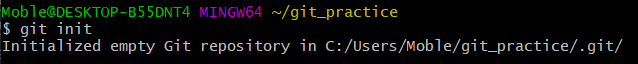
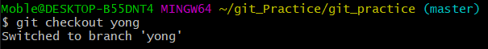
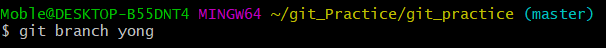
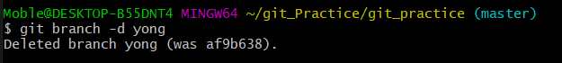
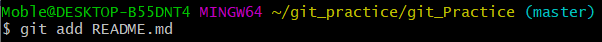
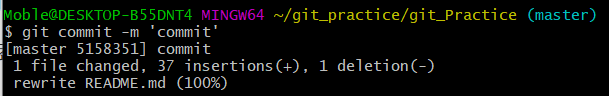

# git_Practice

- <i>git 이란?</i>
    - 소스코드 관리를 위한 분산 버전 관리 시스템
    - 여러 사람이 하나의 프로젝트를 진행할 때 각자가 작업한 코드를 update한다.

- <i>git의 장점</i>
    - 자신의 로컬에서 작업하기 때문에 빠르다.
    - 전체에 영향을 주지 않고 로컬에서 작업하기 때문에 개발 효율이 높아진다.
    - 브랜치를 쉽고 빠르게 작성할 수 있어서 개발 속도 향상과 다양한 기술을 쉽게 적용할 수 있다
    - 장소에 구애받지 않고 협엽이 가능하다.

- <i>git bash 설치</i>
    - [gitbash 다운로드](https://gitforwindows.org/)

- <i>git 용어</i>
    - Repository
        - 저장소는 히스토리, 시간/태그/분기에 따른 다른 버전들을 가지고 있다. git에서 저장소를 다른곳으로 복사하더라도 다시 완벽한 저장소가 된다. 저장소는 작업하고있는 복사본으로 수정본들을 얼마든지 검색 할 수 있다.
    - Branches
        - git 저장소는 모든 분기들과 태그들을 가지고있다. 분기들중 하나는 master라고 불리는 기본 분기이다. 사용자는 작업에 필요한 어떤 한 버전의 분기를이 기본분기로 checkout한다. 이것을 작업카피라 한다
    - Commit
        - 소스 수정사항들은 저장소로 커밋할 수 있다. 이것은 지난 시간까지 추적된 것에 대한 새로운 리비전을 만드는 것이다. 
    - Revision
        - 소스코드의 버전 

- <i>git 명령어</i>
    - git init : git 생성하기
    
    - git clone git_path : 코드가져오기
    - git checkout branch_name : 브랜치 선택하기
    
    - git checkout -t remote_path/branch_name : 원격 브랜치 선택하기
    - git branch branch_name : 브랜치 생성하기
    
    - git branch -r : 원격 브랜치 목록보기
    - git branch -a : 로컬 브랜치 목록보기
    - git branch -m branch_name change_branch_name : 브랜치 이름 바꾸기
    - git branch -d branch_name : 브랜치 삭제하기
    
    - git add file_path : 수정한 코드 선택하기 ( git add * )
    
    - git commit -m “commit_description” : 선택한 코드 설명 적기 ( git commit -m “내용”)
    